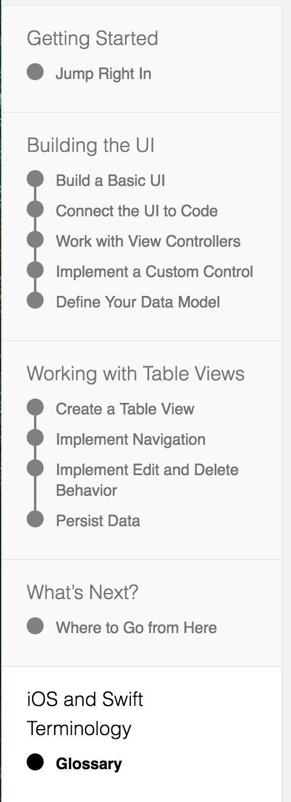

# IOS 起手式

## 体会：

这个教程大部分还是为Swift 3准备的。一些代码写法上和4不同，有些在过程期间还是错误的，最后总体给出的时候是正确的代码。

总之，还是有些坑的 XD。

和前端不同的地方在于，IOS面对自家较少的设备，在画界面的时候容易到飞起，配合Xcode拖动组件进行关联，拖动界面来确定逻辑关系，又拓展了我前端狭小的视野，感叹软硬一体的威力。 
这没有像之前的DW的问题，因为IOS本身组件是相对特化的，功能都很明确。有点类似H5页面的生成工具，但比那要复杂的多，后面的逻辑还是要自己去写的。

我的最终目标还是为了React Native，看懂插件，自己封装个SDK什么的，浅浅体会下IOS开发过程，之后去看OC去了。

小小吐槽下，苹果总是吹嘘自己的系统升级率，但在开发语言上，OC还是占比很多很多啊。

## 打卡：

